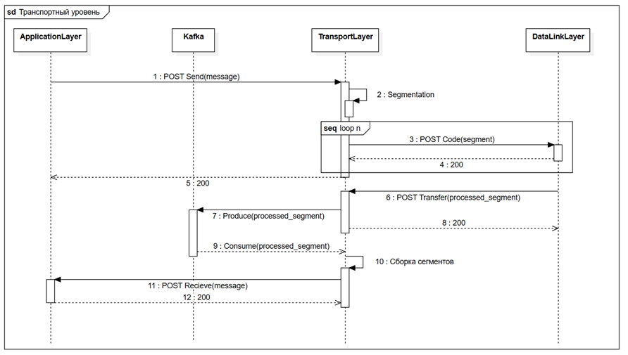
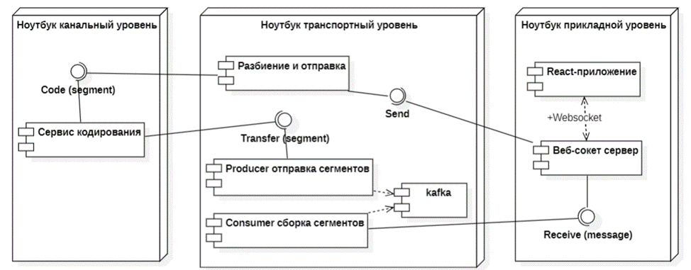

# network_transport_level
Курсовая работа за 6 семестр по Сетям (транспортный уровень)

## Описание

Транспортный уровень предназначен для доставки данных и представляет из себя механизм передачи сообщений. Он также является связующим между прикладным и канальным уровнями. На рисунках 1 и 2 представлены диаграммы последовательности и развёртывания, соответственно. На них можно увидеть, что транспортный уровень должен выдерживать высокую нагрузку, чтобы обеспечивать связь двух бэкендов и не становиться «узким горлышком».





Рассмотрим алгоритм работы транспортного уровня более подробно. Отправной точкой является вызов метода Send прикладным уровнем, в теле запроса в метод передаются имя отправителя, закодированное в строчный формат изображение и метка времени в качестве идентификации сообщения. Далее сообщение сегментируется по 2300 байт, где каждый сегмент имеет полезную нагрузку, метку времени, номер сегмента и общее число сегментов, и посегментно отправляется на канальный уровень посредством вызова метода Code. Обработав сегменты, канальный уровень возвращает каждый из них, вызывая метод Transfer. При выявлении ошибки в теле запроса может быть передан флаг ошибки, чтобы указать конечному пользователю, что сообщение содержит ошибку и не может быть прочитано.
Важной характеристикой транспортного уровня модели OSI является контроль перегрузки (congestion control). Контроль перегрузки – это различные алгоритмы, которые обеспечивают наиболее быструю скорость передачи данных между двумя узлами, передающими данные через TCP. Они управляют размером TCP-окна и могут ориентироваться на RTT (Round Trip Time — время от отправки запроса до получения ответа), потерю пакетов, время ожидания отправки пакета из очереди и т.д. [7] В текущей упрощённой реализации транспортного уровня используется механизм очереди отправки пакета. Полученный с канального уровня сегмент помещается в Kafka. Kafka – это распределенный брокер сообщений, представляющий собой отказоустойчивые конвейеры, работающие по принципу «публикация/подписка» и позволяющие обрабатывать потоки событий [8]. Из очереди раз в 2 секунды они собираются в единое сообщение и передаются на прикладной уровень с вызовом метода Receive. В случае, когда за 2 цикла часть сегментов не была принята, то сообщение передаётся на прикладной уровень с признаком ошибки.

## Запуск

Для запуска проекта необходимо выполнить следующие команды:

```bash
git clone https://github.com/Azat-Bilalov/network_transport_level
cd network_transport_level
docker-compose up
npm install
npm run build
bun dist/index.js
```

